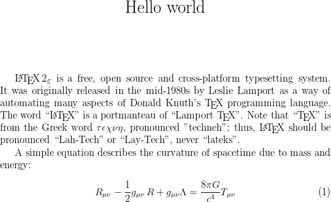

> ## Learning Objectives {.objectives}
>
> * Obtain an overview of what is involved in using LaTeX.
> * Understand what sorts of projects LaTeX is best suited to.

LaTeX is a free, open source and cross-platform typesetting system.
It was originally released in the mid-1980s by Leslie Lamport
as a way of automating many aspects of Donald Knuth's TeX programming language.
The word "LaTeX" is a portmanteau of "Lamport TeX".
Note that *TeX* is from the Greek word *τέχνη*, pronounced "techneh";
thus, LaTeX should be pronounced "Lah-Tech" or "Lay-Tech", never "lateks".

A document made in LaTeX will usually be treated like a software project.
Each section or chapter is put in a different plain text file.
Special command words are used to control the final pdf document.

To see what the final product looks like you have to tell the LaTeX program
to read in the plain text (called the *source*),
and then it will create the final "pretty" version as a PDF.
(This conversion from plain text to PDF is referred to as "compiling".)

This workshop will do some things that look and feel a bit like coding,
but you won't be expected to know anything in advance,
and a lot of the time when writing in LaTeX we can just stick with plain
English.

An example LaTeX document could look like:

~~~ {.tex}
\documentclass[12pt]{article}
\title{Hello world}
\date{}
\begin{document}
\maketitle
\LaTeXe\ is a free, open source and cross-platform typesetting system.
It was originally released in the mid-1980s by Leslie Lamport
as a way of automating many aspects of Donald Knuth's \TeX\ programming language.
The word ``\LaTeX'' is a portmanteau of ``Lamport \TeX{}''.
Note that ``\TeX'' is from the Greek word $\tau\epsilon\chi\nu\eta$, pronounced "techneh";
thus, \LaTeX\ should be pronounced ``Lah-Tech'' or ``Lay-Tech'', never ``lateks''.

A simple equation describes the curvature of spacetime due to mass and energy:

\begin{equation}
  R_{\mu \nu} - {1 \over 2}g_{\mu \nu}\,R + g_{\mu \nu} \Lambda = {8 \pi G \over c^4} T_{\mu \nu}
\end{equation}
\end{document}
~~~

This then gets converted to a PDF which looks a bit like this:

Due to the overhead in setting up a new LaTeX project,
people usually consider it contraindicated for small,
uncomplicated documents with no special typesetting requirements.
For these you'll usually be better off with markdown
or a conventional word processor.

LaTeX comes into its own when you either have special typesetting requirements
or a large document with lots of cross-references and citations.
As a rule of thumb, consider using LaTeX for any document
longer than a novella or more complicated than a technical report,
especially if you need to display mathematics.

> ## A first LaTeX document {.challenge}
>
> Copy and paste the above LaTeX into your editor and then check whether you can
> compile it.
>
> (If you try compiling and get an error, it might look like LaTeX freezes up,
> but it's just waiting for you to tell it how to proceed.
> If this happens, enter the letter "X" and press enter to terminate compilation.)
